# OpenClaw Mini CRM — Full Product Analysis

> **Analyzed**: 2026-03-28 | **URL**: https://crm.satistang.com/dashboard/chat
> **Product**: OpenClaw Mini CRM v1.0 — AI Chat Intelligence
> **Mascot**: น้องกุ้ง (Kung the Shrimp) — AI that manages the entire system
> **Analyzed by**: Nexus Oracle (AI)

---

## Table of Contents

1. [Overview](#overview)
2. [Tech Stack](#tech-stack)
3. [Page Map (22 pages)](#page-map-22-pages)
4. [Detailed Page Analysis](#detailed-page-analysis)
5. [Strengths](#strengths)
6. [Improvement Suggestions](#improvement-suggestions)
7. [Competitive Landscape](#competitive-landscape)
8. [Verdict](#verdict)

---

## Overview

OpenClaw Mini CRM is a Thai-first AI-powered CRM designed for SMEs selling via social commerce channels (LINE, Facebook, Instagram, Telegram). Its core differentiator is **"น้องกุ้ง"** — an AI assistant that analyzes chat conversations, scores customer sentiment, and helps close sales automatically.

The product is organized into **7 sections** containing **22 distinct pages**.

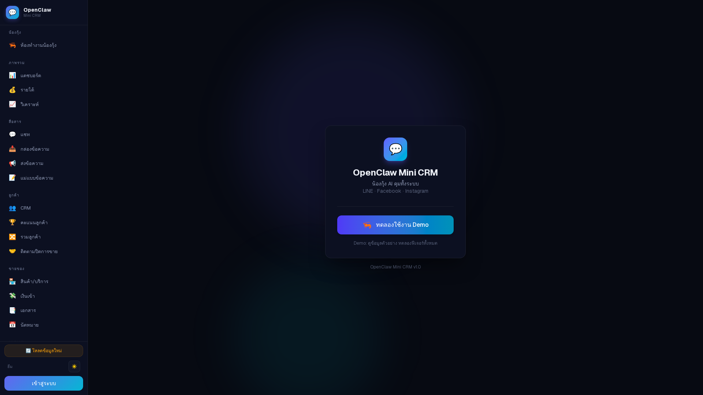

---

## Tech Stack

| Layer | Technology | Evidence |
|-------|-----------|----------|
| **Framework** | Next.js (App Router + Turbopack) | `_next/static/chunks/turbopack-*.js`, `__next` root div |
| **UI Library** | React 18+ | Server Components pattern, Next.js App Router |
| **Styling** | Tailwind CSS | Utility classes throughout (`flex`, `antialiased`) |
| **Typography** | Geist Sans + Geist Mono | Vercel's font (`geist_a71539c9-module`) |
| **3D Engine** | Three.js / WebGL | 3D avatar room (kung-room page) |
| **Auth** | NextAuth.js | Google OAuth, `/api/auth/callback` pattern |
| **Database** | MongoDB | Mentioned in setup guide as step 1 |
| **AI/ML** | Custom pipeline | Sentiment analysis, chat scoring, RAG embeddings |
| **Channels** | LINE OA, Facebook Messenger, Instagram DM, Telegram | Multi-channel integration via connections page |
| **Deployment** | Likely Vercel | Geist font + Turbopack + Next.js signals Vercel ecosystem |
| **PWA** | Yes | `mobile-web-app-capable`, `apple-mobile-web-app-title` meta tags |
| **Theme** | Dark-first | Default dark mode, light toggle available |

### Stack Assessment

**Strengths**: Modern, well-chosen stack. Next.js + Tailwind is battle-tested for SaaS. Turbopack indicates cutting-edge dev tooling.

**Concerns**: MongoDB for CRM data (relational queries like "all customers who bought X in the last 30 days" are harder in document DBs). Three.js for the 3D room is impressive but heavy — potential performance issue on low-end devices.

---

## Page Map (22 pages)

```
OpenClaw Mini CRM
├── น้องกุ้ง (AI Hub)
│   └── ห้องทำงานน้องกุ้ง        /dashboard/kung-room      ← 3D workspace
│
├── ภาพรวม (Overview) — 3 pages
│   ├── แดชบอร์ด                 /dashboard
│   ├── รายได้                   /dashboard/revenue
│   └── วิเคราะห์                /dashboard/analytics
│
├── สื่อสาร (Communication) — 4 pages
│   ├── แชท                     /dashboard/chat
│   ├── กล่องข้อความ             /dashboard/inbox
│   ├── ส่งข้อความ               /dashboard/broadcast
│   └── แม่แบบข้อความ            /dashboard/templates
│
├── ลูกค้า (Customers) — 4 pages
│   ├── CRM                     /dashboard/crm
│   ├── คะแนนลูกค้า              /dashboard/scorecard
│   ├── รวมลูกค้า                /dashboard/merge
│   └── ติดตามปิดการขาย           /dashboard/auto-closer
│
├── ขายของ (Sales) — 4 pages
│   ├── สินค้า/บริการ             /dashboard/catalog
│   ├── เงินเข้า                 /dashboard/payments
│   ├── เอกสาร                   /dashboard/documents
│   └── นัดหมาย                  /dashboard/appointments
│
├── รายงาน (Reports) — 3 pages
│   ├── KPI พนักงาน              /dashboard/kpi
│   ├── ค่าใช้จ่าย AI            /dashboard/costs
│   └── น้องกุ้ง (advice)        /dashboard/advice
│
├── ตั้งค่า (Settings) — 6 pages
│   ├── ช่องทาง                  /dashboard/connections
│   ├── บอท                     /dashboard/bot-config
│   ├── คลังความรู้               /dashboard/km
│   ├── ทีมงาน                   /dashboard/team
│   ├── งาน                     /dashboard/tasks
│   └── ตั้งค่า                  /dashboard/settings
│
└── ช่วยเหลือ (Help) — 1 page
    └── คู่มือ                   /dashboard/guide
```

---

## Detailed Page Analysis

### 1. ห้องทำงานน้องกุ้ง (Kung's 3D Workspace)

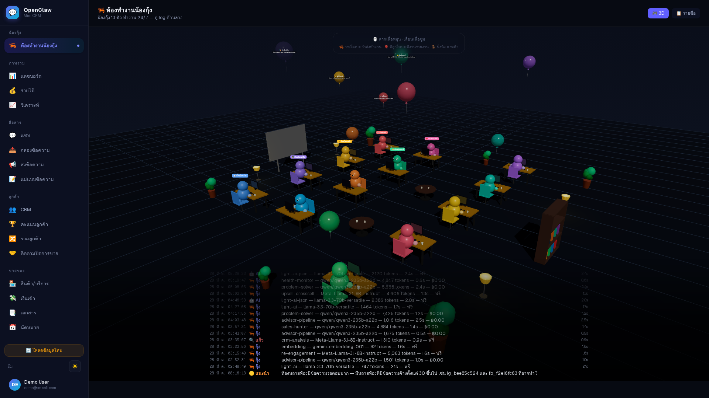

**What it is**: A 3D isometric room rendered in WebGL showing customer/agent avatars as colorful 3D figures on a grid. Real-time stats overlay at the bottom.

**Unique factor**: This is the most visually distinctive feature — no other Thai CRM has a 3D command center. It makes the AI feel "alive" rather than just a dashboard.

**Concerns**: Heavy 3D rendering may struggle on older phones/tablets. Text overlay at the bottom is small and hard to read.

---

### 2. รายได้ (Revenue)

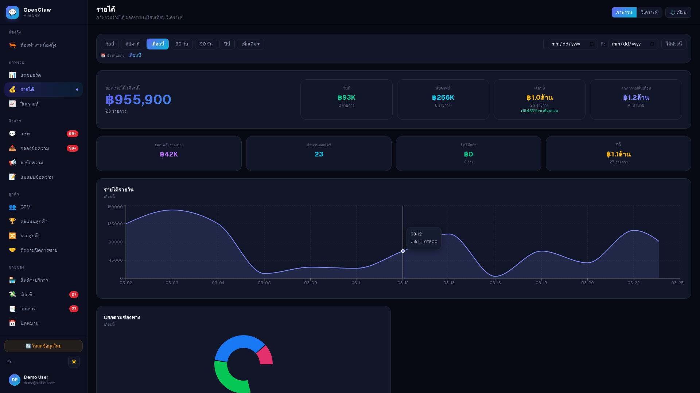

**What it is**: Revenue dashboard showing:
- Total revenue: **฿955,900**
- Key metrics: ฿53K, ฿150K, ฿1.04M breakdowns
- Time-series chart of daily revenue (area chart)
- Payment method donut chart
- Filter tabs: today/week/month/custom

**Good**: Clean visualization, clear numbers, time filters work well.
**Can improve**: No comparison to previous period, no growth percentage indicators.

---

### 3. แชท (Chat)

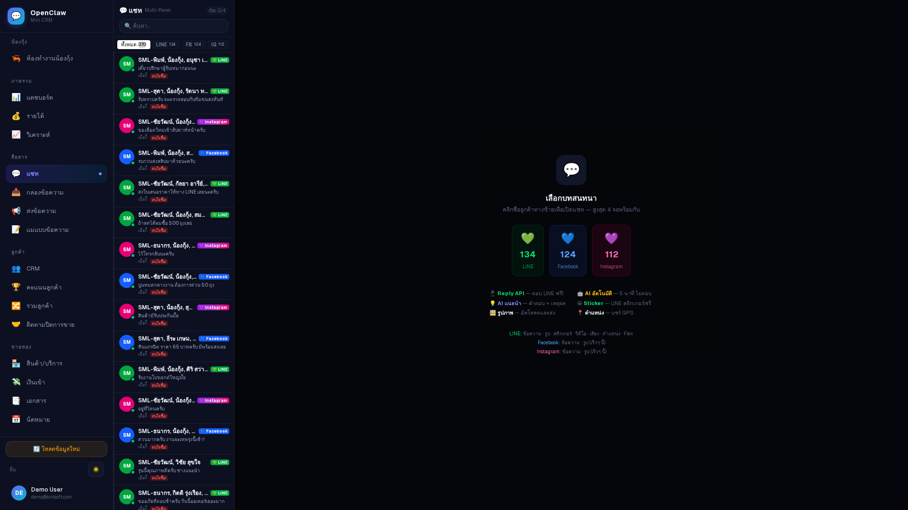

**What it is**: Unified chat inbox across all channels. Left panel shows conversation list with:
- Customer name + last message preview
- Channel indicator (LINE/FB/IG)
- Timestamp
- AI sentiment scores (green hearts = positive, red = negative)
- Numerical AI scores (13.4, 12.4, 11.2)

Center shows onboarding when no chat is selected with feature highlights.

**Good**: Multi-channel unification is the core value prop and it's well-executed.
**Can improve**: Conversation list text is very small. Sentiment scores lack explanation for new users.

---

### 4. CRM (Customer Management)

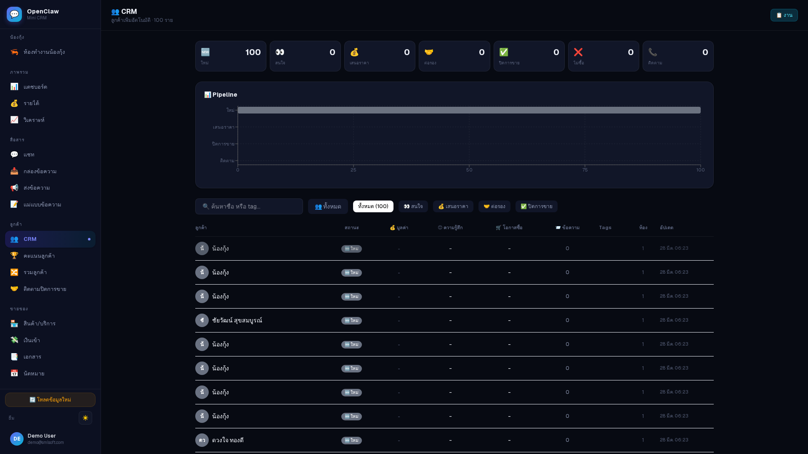

**What it is**: Customer database with:
- **100 contacts** tracked
- Pipeline view (kanban-style)
- Filter bar with tags, channel, status
- Table view with customer name, phone, tags, score
- Top stats: total, active, scored, etc.

**Good**: Pipeline view is essential for sales teams. Tag system is flexible.
**Can improve**: No visible bulk actions. Search bar could be more prominent. Pipeline stages need customization.

---

### 5. คะแนนลูกค้า (Customer Scorecard)

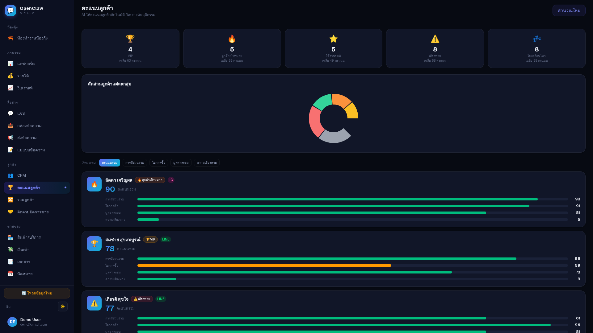

**What it is**: AI-generated customer scoring with:
- Donut chart overview (score distribution)
- Per-customer cards with score (90, 78, 77) and colored progress bars
- Multiple score dimensions shown per customer

**Good**: Visual scoring makes it easy to identify hot leads at a glance.
**Can improve**: Score criteria should be explained. No "what should I do with this score?" guidance.

---

### 6. สินค้า/บริการ (Product Catalog)

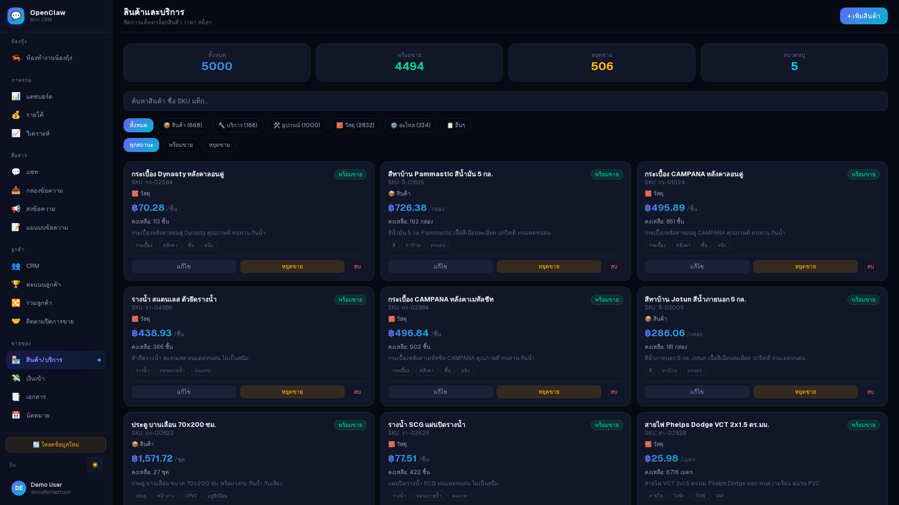

**What it is**: Product/service catalog with:
- **5,000 total items**, **4,494 active**, **506 inactive**, **5 categories**
- Card grid layout with product image, name, price (฿70-฿1,571), stock
- Status badges (active/inactive)
- Quick action buttons per card

**Good**: Clean card layout, clear stock/price info. Category filtering works.
**Can improve**: No bulk import/export. No variant support visible. Could use grid/list toggle.

---

### 7. บอท (Bot Configuration)

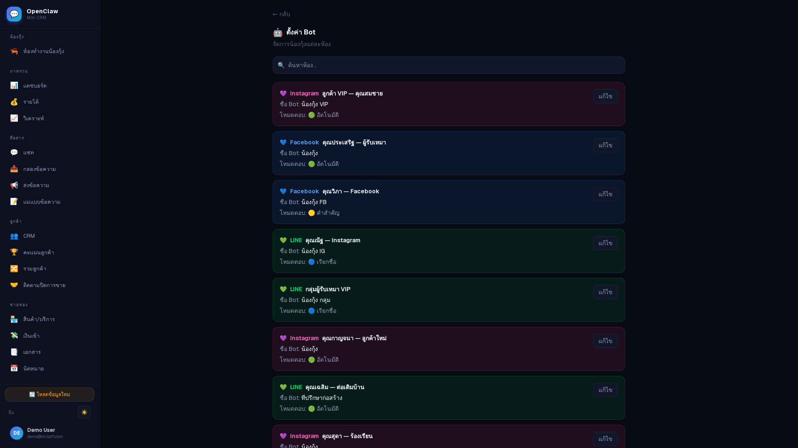

**What it is**: Bot management showing **8+ configured bots** across channels:
- Each bot has a color-coded card (green=LINE, blue=Facebook, purple=Instagram, cyan=Telegram)
- Bot name, channel, status, personality settings
- Edit/toggle per bot

**Good**: Multi-bot support is powerful — different bots for different channels/purposes.
**Can improve**: No visible bot conversation flow builder. No A/B testing between bot versions.

---

### 8. คลังความรู้ (Knowledge Base / RAG)

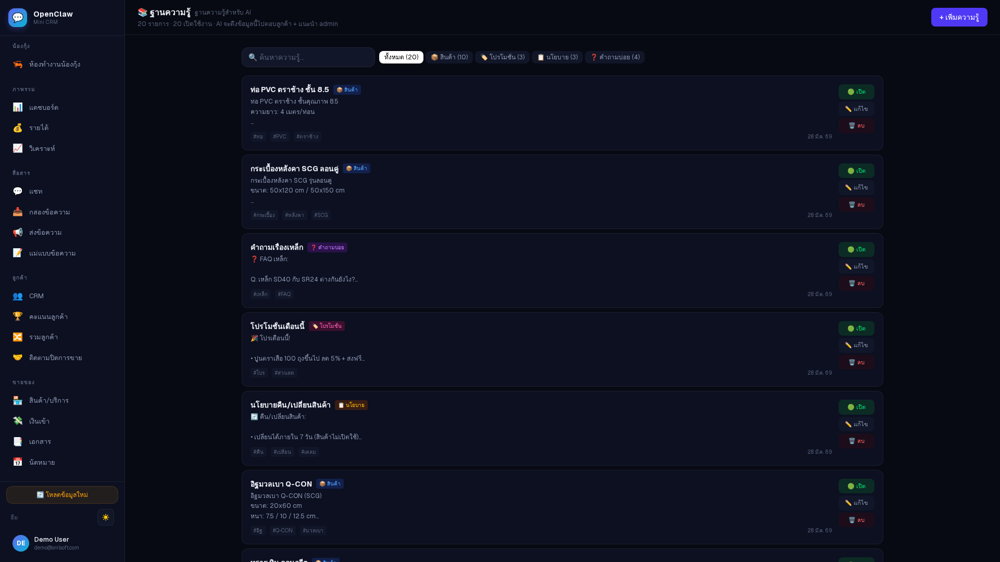

**What it is**: RAG (Retrieval-Augmented Generation) document store:
- Upload documents for AI to learn from
- Auto-chunking with embedding indicators
- File type icons, chunk counts, status badges
- Multiple knowledge domains

**Good**: This is the engine behind the AI's intelligence — well-structured.
**Can improve**: No visible "test your knowledge base" feature. No analytics on which docs get referenced most.

---

### 9. ติดตามปิดการขาย (Auto-Closer)

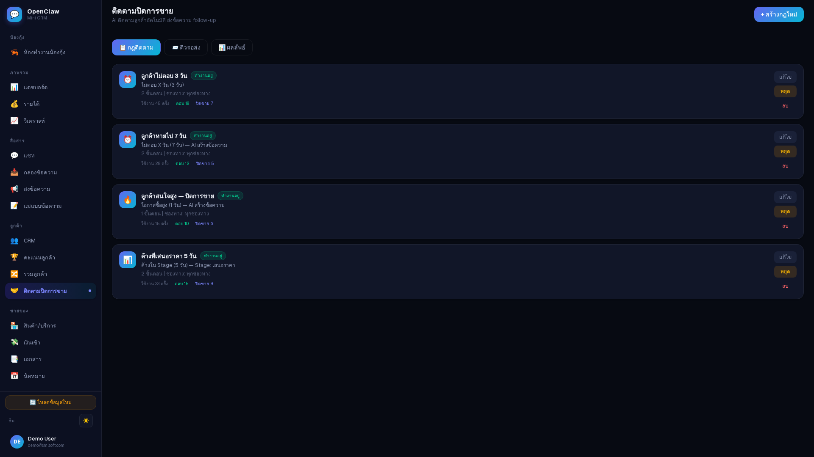

**What it is**: Sales follow-up automation:
- Tracks leads at different stages with time-based follow-ups
- Status badges (pending, following up)
- Customer cards with stage, time since last contact
- Auto-reminder system

**Good**: Solves a real pain point — Thai SMEs often forget to follow up.
**Can improve**: No visible customization of follow-up sequences. Could show conversion rates per stage.

---

### 10. ส่งข้อความ (Broadcast)

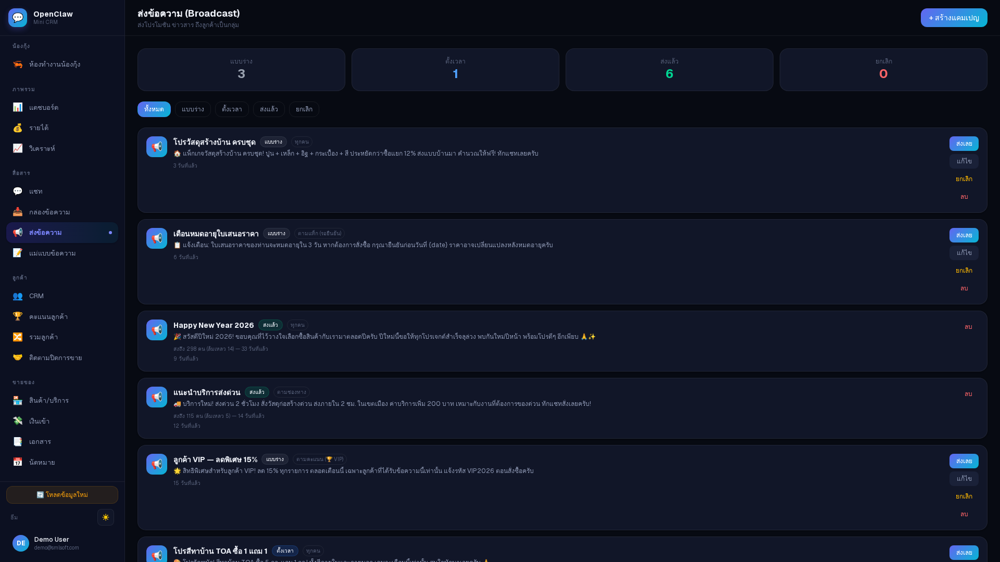

**What it is**: Bulk messaging system:
- **3 drafts**, **1 sent**, **6 scheduled**, **0 failed**
- Message cards with content preview, audience count, status
- Targeting options

**Good**: Essential for promotions. Draft/schedule workflow is practical.
**Can improve**: No A/B testing. No visible analytics on open/click rates per broadcast.

---

### 11. เงินเข้า (Payments)

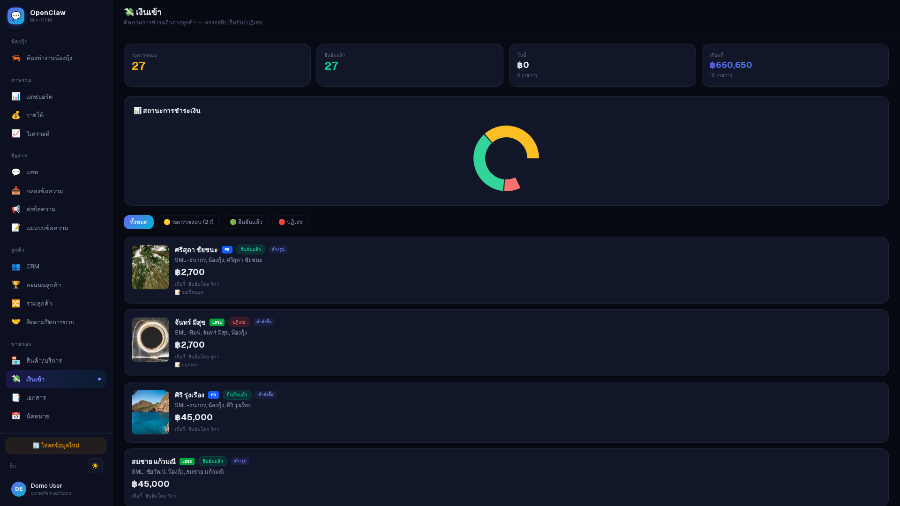

**What it is**: Payment tracking:
- **27 pending**, **27 confirmed**, **฿0 unmatched**, **฿860,650 total**
- Donut chart by payment method
- Transaction list with customer name, amount, status
- Amounts: ฿2,700, ฿45,000

**Good**: Clear payment status tracking. Total revenue visible.
**Can improve**: No PromptPay/banking integration visible. No auto-matching of bank transfers.

---

### 12. เชื่อมต่อช่องทาง (Connections)

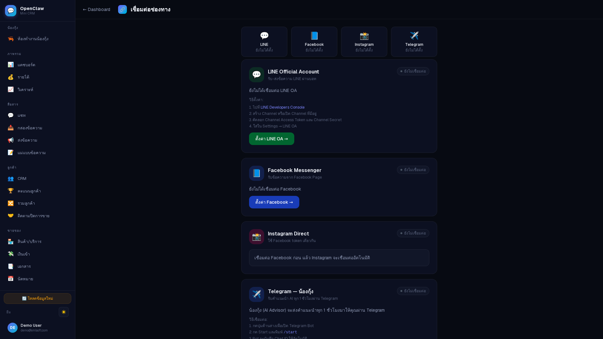

**What it is**: Channel integration setup:
- **LINE Official Account** — with setup instructions
- **Facebook Messenger** — with connect button
- **Instagram Direct** — linked via Facebook
- **Telegram** — bot token setup

**Good**: Clean setup flow with step-by-step instructions per channel.
**Can improve**: No webhook status/health indicator. No "test connection" button.

---

### 13. ทีมงาน (Team)

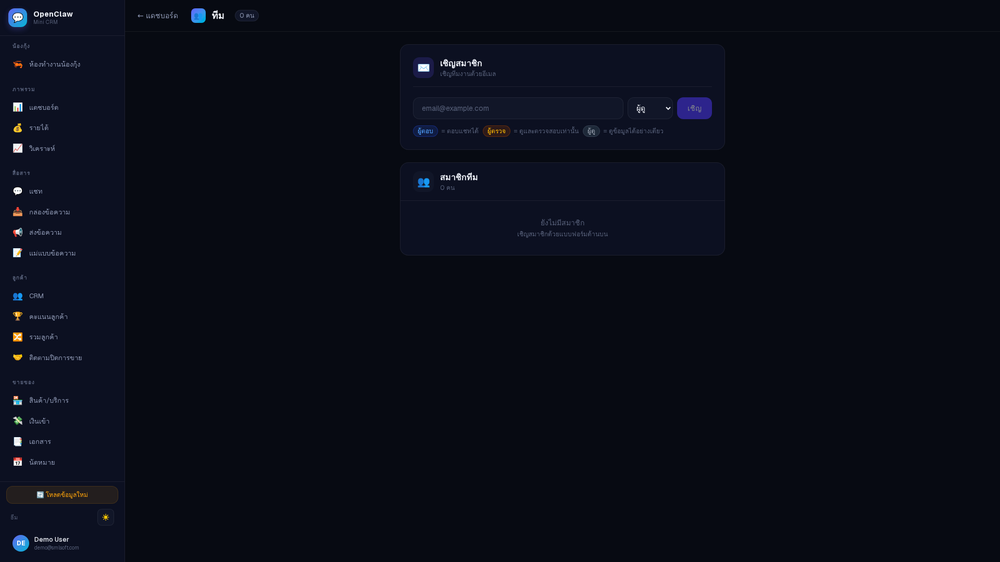

**What it is**: Team management:
- Invite by email with role selector (คนดู/ตรวจ/ดูแลทุกอย่าง/etc.)
- **5 role levels**: viewer, checker, manager, admin, owner
- Team member list (currently empty in demo)

**Good**: RBAC (role-based access control) is essential for teams. Clean UI.
**Can improve**: No visible activity log per team member. No shift/assignment system.

---

### 14. KPI พนักงาน (Employee KPI)

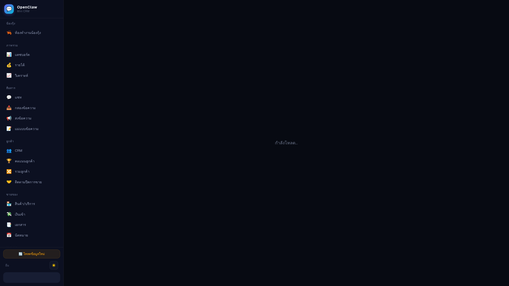

**Note**: Page shows "กำลังโหลด..." (Loading...) — didn't fully render in demo mode.

---

### 15. คู่มือ (Guide)

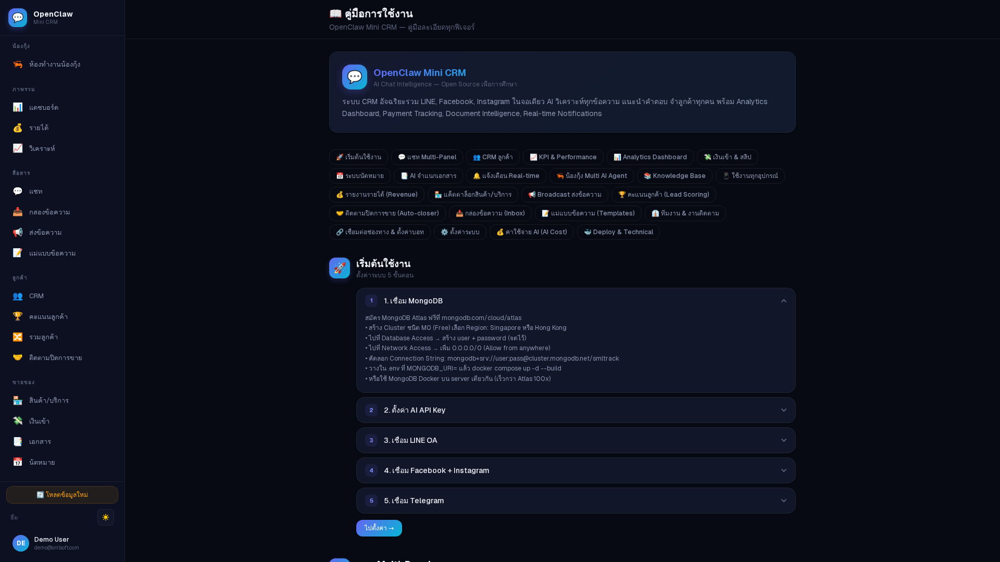

**What it is**: Onboarding guide with:
- Feature overview badges (all key features listed)
- Step-by-step accordion: MongoDB setup, AI API Key, LINE OA, Facebook/Instagram, Telegram
- Clean layout with numbered steps

**Good**: Comprehensive onboarding. Thai-language instructions.
**Can improve**: Could be interactive wizard instead of static page. Video tutorials would help.

---

### 16. วิเคราะห์ (Analytics)

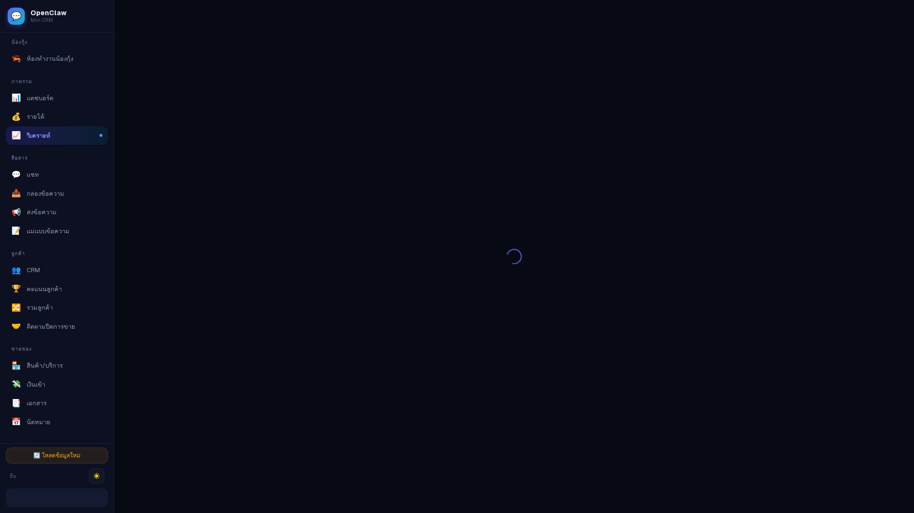

**Note**: Page was loading/spinning during capture — may require real data.

---

## Strengths

### 1. Thai-First Design
- All UI in Thai — massive advantage over English-first competitors (HubSpot, Salesforce)
- Thai pricing (฿), Thai product names, Thai date formats
- Emoji-based navigation is culturally appropriate and friendly

### 2. AI-Native Architecture
- Not "AI bolted on" — AI is the core (sentiment analysis, auto-scoring, auto-closer, RAG knowledge base)
- "น้องกุ้ง" branding makes AI approachable for non-tech users
- AI cost tracking shows transparency about usage

### 3. Multi-Channel Unification
- LINE (Thailand's #1 chat app) + Facebook + Instagram + Telegram in one inbox
- This is the exact pain point for Thai SME sellers who manage 3-4 channels manually

### 4. Visual Identity
- 3D workspace is memorable and unique
- Dark theme is modern and well-executed
- Consistent emoji language throughout navigation

### 5. Complete Sales Toolkit
- From lead capture (chat) -> scoring -> follow-up -> payment -> reporting
- Full funnel in one tool

---

## Improvement Suggestions

### Critical (High Impact)

| Area | Issue | Suggestion |
|------|-------|-----------|
| **Loading States** | Analytics + KPI stuck on spinner | Add skeleton loading, error boundaries, empty states |
| **Data Export** | No visible CSV/PDF export | Essential for accounting, tax reporting — Thai SMEs need this for tax season |
| **Mobile UX** | `user-scalable=no` + small text | Many Thai sellers work from phones — text needs to be larger, touch targets bigger |
| **Onboarding** | Static guide page | Interactive wizard with progress tracking, "setup score" |

### Important (Medium Impact)

| Area | Issue | Suggestion |
|------|-------|-----------|
| **Bot Builder** | No visual flow builder | Competitors like ManyChat have drag-and-drop flows — consider adding |
| **Broadcast Analytics** | No open/click tracking | Add delivery, read, click metrics per broadcast |
| **Payment Integration** | No auto-matching | PromptPay QR generation + bank statement auto-match would be game-changing |
| **Search** | Basic text search only | Full-text search across conversations, customers, products |
| **API/Webhooks** | No visible integration page | Third-party integration (Shopee, Lazada, accounting software) is essential |

### Nice to Have (Lower Impact)

| Area | Suggestion |
|------|-----------|
| **3D Room Performance** | Lazy-load Three.js, add low-quality fallback for slow devices |
| **A/B Testing** | Test different bot responses, broadcast messages |
| **Workflow Automation** | "When customer scores > 80, auto-assign to senior sales" |
| **Multi-language** | English toggle for international teams |
| **Offline/PWA** | Push notifications for new messages, basic offline access |
| **Score Explanation** | Show WHY a customer scored 90 vs 78 — which signals contributed |

---

## Competitive Landscape

| Feature | OpenClaw | Oho Chat | Chat Center | Zendesk | HubSpot |
|---------|----------|----------|-------------|---------|---------|
| Thai UI | Yes | Yes | Yes | No | No |
| LINE Integration | Yes | Yes | Yes | Plugin | No |
| AI Chat Analysis | **Yes** | Limited | No | No | No |
| Customer Scoring | **AI-auto** | Manual | No | No | Yes |
| 3D Visualization | **Unique** | No | No | No | No |
| Knowledge Base RAG | **Yes** | No | No | Yes | Yes |
| Auto-Closer | **Yes** | No | No | No | Yes |
| Price (est.) | SME-friendly | Mid | Low | High | High |

**OpenClaw's moat**: AI-native + Thai-first + affordable. The combination of auto-scoring, RAG knowledge base, and multi-channel chat is strong for the Thai SME market.

---

## Verdict

**Overall Score: 7.5/10**

**OpenClaw Mini CRM is a well-built, AI-native Thai CRM** that solves real problems for Thai social commerce sellers. The tech stack is modern (Next.js + Tailwind + MongoDB), the AI features (sentiment scoring, RAG, auto-closer) are genuinely differentiated, and the Thai-first approach is a strong market fit.

**Biggest strengths**: AI integration depth, multi-channel chat, visual design, Thai localization.

**Biggest gaps**: Loading state handling, data export, mobile optimization, lack of workflow automation builder.

**For the education angle**: This is a great case study of how to build an AI-native SaaS product for a specific market. Key lessons:
1. **AI should be the core, not a feature** — น้องกุ้ง IS the product
2. **Localization matters** — Thai-first beats translated-English
3. **Channel integration is king** — LINE + FB + IG in one inbox solves a real daily pain
4. **Visual differentiation** — the 3D room makes it memorable

---

*Report generated by Nexus Oracle | 2026-03-28*
*AI-generated analysis — not human-authored*
